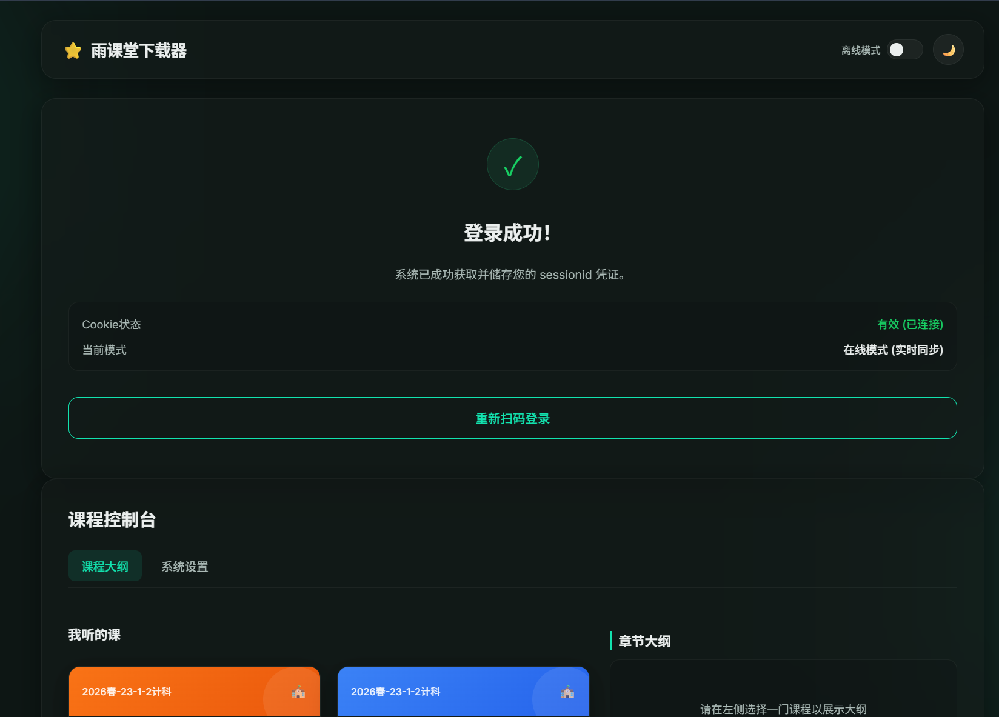
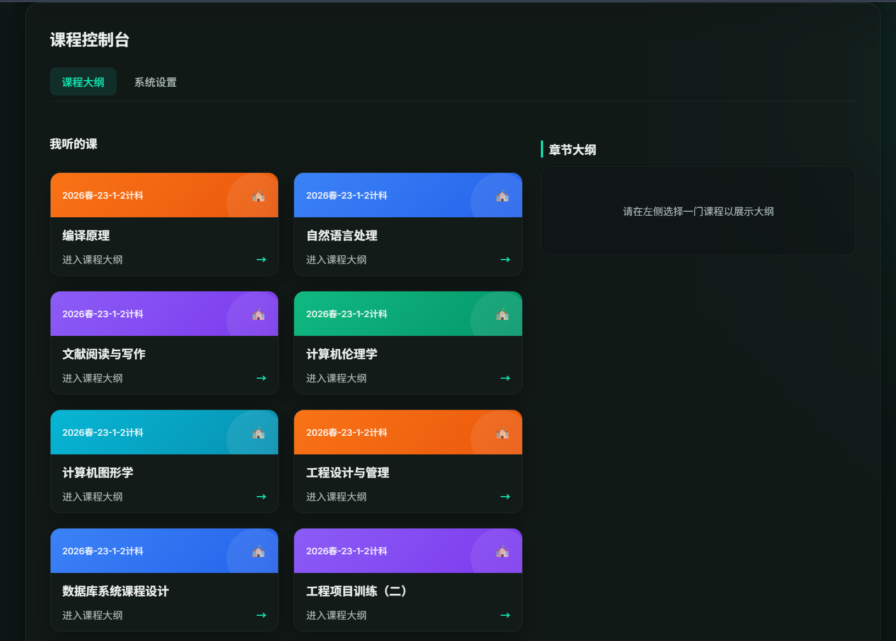
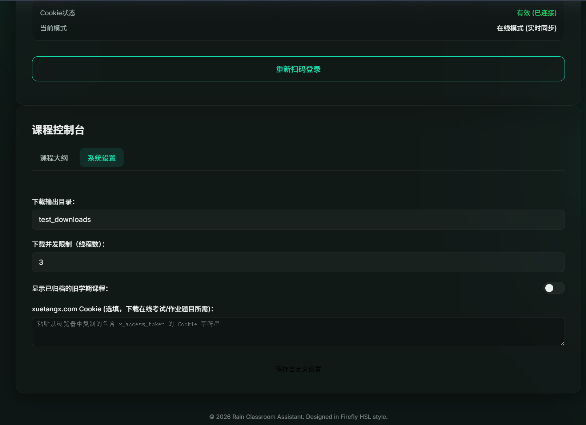
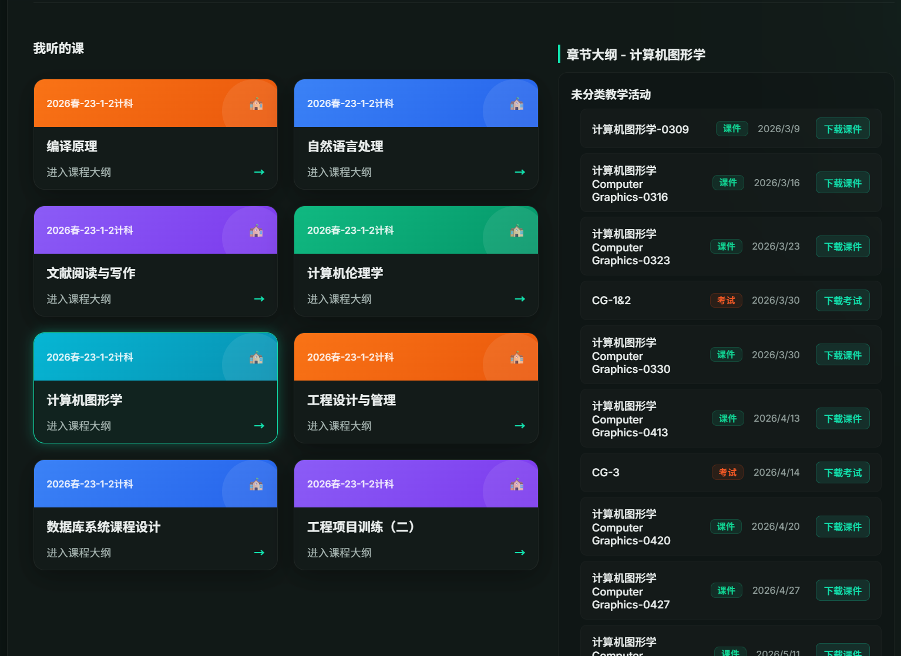

# Rain Classroom Web Downloader (雨课堂网页端课件下载器)

一个基于 **Bun** 和 **ElysiaJS** 构建的雨课堂课件与试卷下载/备份工具。支持微信扫码登录、在线/离线双模式、自定义下载并发数以及随堂习题自动提取。

---

## 项目亮点与特性

1. **微信扫码登录 (WeChat QR Login)**：直接在网页端显示登录二维码，扫码后后台自动与雨课堂主站及学堂在线 (Xuetangx) 进行 SSO Token 握手获取凭证，免去手动抓取 Cookie 的繁琐操作。
2. **在线/离线双模式 (Online/Offline Toggle)**：
   - **在线模式**：连接雨课堂服务器，直接拉取最新的课程、课件列表，并下载最新课件。
   - **离线模式**：在无网络时自动读取 `docs/` 目录下的 `.har` 网络存档文件，并在网页前端渲染离线仪表盘，用于课件的历史浏览和查看。
3. **学期归档过滤 (Term Filter)**：默认只显示当前活跃学期（如 2026 春季学期，代码 `202502`），可通过设置面板一键开启“显示归档课程”以备份历史学期的资料。
4. **自定义配置 (Custom Setup)**：可在设置页面或配置文件中修改下载保存路径以及多线程并发限制，防止因请求过快被服务器临时限制连接。
5. **课件与习题提取 (Slide & Problem Extraction)**：下载课件幻灯片时，系统会自动分析并提取包含随堂测试题目的幻灯片页，将其单独分类保存于 `problem/` 目录下，便于期末复习。

---

## 界面展示 (Screenshots)

以下是该工具运行时的实际效果。我们已将截图重命名为标准的英文文件名，并在下方引入：

1. **微信扫码登录界面**
   
   *注：启动项目后，用户可在此界面通过微信扫码快速同步雨课堂的登录状态。*
2. **课程仪表盘 (Dashboard)**
   
   *注：登录成功后进入的主界面，展示当前学期和归档的历史课程列表。*
3. **课件下载中心**
   
4. **高级设置面板**
   

---

## 快速开始 (Quick Start)

### 环境要求 (Prerequisites)

- 本项目基于 Bun 运行时开发，请确保您的系统已安装了 [Bun](https://bun.sh/)

<!-- 注释：Bun 是一个高性能的现代 JavaScript 运行时。官方网站：https://bun.sh -->

### 1. 安装项目依赖

在项目根目录打开终端并运行：

```bash
bun install
```

### 2. 配置文件

项目使用 `config/default.json` 作为运行配置文件。
你可以通过复制 `config/default.example.json` 来创建配置文件：

```bash
cp config/default.example.json config/default.json
```

*(注：如果启动时未找到 `default.json`，系统也会自动使用默认配置生成该文件。)*

`default.example.json` 的具体格式如下：

```json
{
  "port": 3000,
  "hue": 165,
  "downloadDir": "downloads",
  "concurrency": 5,
  "offlineMode": false,
  "showArchived": false,
  "yuketangUrl": "https://www.yuketang.cn",
  "yuketangWsUrl": "wss://www.yuketang.cn/wsapp/",
  "cookies": {
    "sessionid": "",
    "csrftoken": "",
    "xtbz": "ykt",
    "university_id": "",
    "platform_id": "3",
    "_cf_bm": "",
    "x_access_token": "",
    "_abfpc": "",
    "cna": "",
    "sensorsdata2015jssdkcross": "",
    "xt_lang": "zh"
  }
}
```

### 3. 运行项目

- **开发模式**（支持热重载，代码修改后自动重启）：

  ```bash
  bun run dev
  ```
- **生产模式**（直接运行）：

  ```bash
  bun start
  ```

启动成功后，请在浏览器中访问：[http://localhost:3000](http://localhost:3000)

<!-- 注释：默认运行于 3000 端口，若端口被占用可在 config 中修改 port 字段 -->

---

## 致谢与参考项目 (Credits)

在项目开发过程中，作者学习并借鉴了以下优秀的开源项目，特此致谢：

- **[ChangjiangRainClassroomAssistant](https://github.com/Zeshawn-z/ChangjiangRainClassroomAssistant)**
  - 提供了大量长江雨课堂 API 返回字段格式和网络交互的参考。
- **[RainClassroomAssitant-standalone](https://github.com/Sonder9999/RainClassroomAssitant-standalone)** 与 **[ChangjiangRainClassroomAssistant (Fork)](https://github.com/Sonder9999/ChangjiangRainClassroomAssistant)**
- **[RainClassroom-Assistant](https://github.com/Fly-Playgroud/RainClassroom-Assistant)**
  - 另一个优秀的雨课堂课件和习题 API 参考项目。
- **[Firefly](https://github.com/CuteLeaf/Firefly)**
  - 本项目网页端极简、柔和卡片式前端 UI 配色和夜间模式的设计灵感来源。

---

## 📜 开源许可证 (License)

本项目基于 **[MIT License](https://opensource.org/licenses/MIT)** 进行开源发布。

您可在此仓库中自由使用、修改和分发本项目代码，但须在您的修改版本中附带 MIT 版权声明。

---

## ⚖️ 免责声明 (Disclaimer)

> [!WARNING]
> **在下载或运行本项目前，请仔细阅读以下条款。使用本软件即代表您已知悉并完全同意以下内容：**

1. **学术研究与复习用途**：本项目仅限个人用于学术研究、对自身已选课程的课件/习题进行备份以便离线复习。请勿将下载获得的任何课件、讲义、视频、随堂测试等资料用于商业用途、网络传播或其他任何侵犯教师及学校知识产权的行为。
2. **拒绝辅助违规行为**：本项目为**只读备份与课件整理工具**，**不提供**任何自动挂机刷课、课后作业自动答题、网课签到等违反学校管理规定或雨课堂服务协议的辅助功能。请勿尝试修改代码以实现任何破坏教学公平性的作弊行为。
3. **平台策略与封号风险**：雨课堂及学堂在线平台可能会不定期更新安全限制和反爬虫策略。因使用本项目导致 IP 暂时性限流、账号功能受限、封禁等，项目作者不承担任何间接或直接责任。建议控制下载并发数（默认设置为 5 线程），合理下载，不要对平台服务器造成压力。
4. **无担保声明**：本项目“按原样 (As Is)”提供，不附带任何明示或暗示的保证（包括但不限于对接口未来持续可用性、备份数据完整性的保证）。
